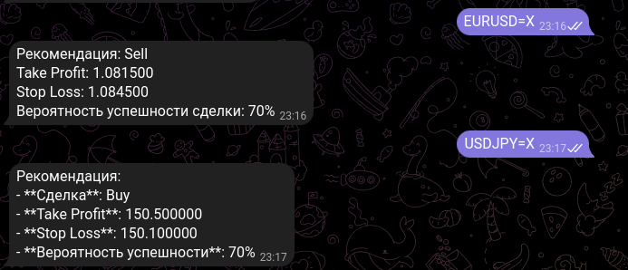

# Telegram Forex Bot GPT-4o-mini


## Описание
Telegram-бот, который предоставляет сигналы по валютным парам благодаря GPT-4o mini. Пользователи могут выбрать валютную пару из меню, и бот ответит с соответствующими данными.

## Установка

1. **Клонируйте репозиторий:**

   ```bash
   git clone https://github.com/timurkaff/Forex-GPT-4o-mini.git
   cd Forex-GPT-4o-mini
   ```

Создайте виртуальное окружение (опционально):
```bash
python -m venv venv
source venv/bin/activate  # Для Linux/Mac
venv\Scripts\activate  # Для Windows
```

2.Установите необходимые библиотеки:
```bash
pip install -r req.txt
```

3. Для запукса бота используете в своем терминале команду:
```python
python main.py
```

После запуска бот будет доступен в Telegram. Вы можете начать взаимодействие с ним, отправив команду /start.

## Вклад
Если вы хотите внести свой вклад в проект, пожалуйста, создайте форк репозитория, внесите изменения и отправьте пулл-реквест.
